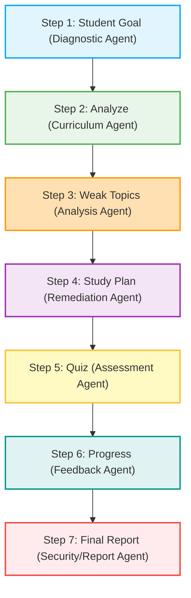

# Education Gap AI Agent (ADK Multi-Agent System)

An advanced, security-first **Education Gap AI Agent** designed using a Multi-Agent architecture to identify learning gaps in students and dynamically guide them through a personalized remediation pipeline. The system utilizes the Model Context Protocol (MCP) to fetch curriculum standards, offers a unified Command Line Interface (Agents CLI) for interaction, and enforces strict security protocols (PII Anonymization & Session Log Encryption) to ensure student privacy.

---

## 🌟 Key Features

- **Multi-Agent System (ADK):** Sequential state passing between specialized agents (Diagnostic, Curriculum, Assessment, Remediation).
- **Model Context Protocol (MCP) Integration:** Dynamic fetching of verified educational databases, textbooks, and standardized curricula (e.g., AP, Common Core).
- **Agent CLI Skills:** Command-line suite to parse student inputs, run code snippets, and manage active learning sessions.
- **Privacy & Security first:** Automatic identification and anonymization of Personally Identifiable Information (PII) before external API queries or MCP transmission. Session logs are encrypted locally using AES-256.

---

## 📐 System Architecture & Pipeline Flow

The agent system operates through a sequential, state-passing pipeline. Each step must be successfully completed and verified before proceeding to the next.



---

## 🔄 Sequential Execution Pipeline (7 Steps)

### Step 1: Student Goal
- **Agent:** Diagnostic Initialization Agent
- **Description:** Collects target objectives, grades/levels, and milestones from the student.
- **Example Inputs:**
  - Subject: AP Physics 1
  - Current Level: Grade 11 (High School)
  - Target Objective: Pass the AP Physics Exam with a score of 4 or 5.

### Step 2: Analyze
- **Agent:** Curriculum & Diagnostic Agent
- **Description:** Queries the **MCP Server** to fetch the corresponding standardized curriculum guidelines. Generates a conceptual baseline evaluation consisting of target-heavy questions.
- **MCP Queries:**
  - `mcp://curriculum-standards/ap-physics-1`
  - `mcp://educational-textbooks/mechanics-rotational`

### Step 3: Weak Topics
- **Agent:** Analysis & Gap Isolation Agent
- **Description:** Isolates exact knowledge gaps, conceptual bugs, or errors made during Step 2.
- **Output:** A bulleted checklist of precise weak topics needing immediate remediation (e.g., *"Understanding Angular Momentum Conservation"* or *"Frictional Torque Application"*).

### Step 4: Study Plan
- **Agent:** Remediation Planner Agent
- **Description:** Formulates a structured, step-by-step study schedule mapped directly to the weak topics list. Includes timeline estimates, resource links, and study advice.

### Step 5: Quiz
- **Agent:** Targeted Assessment Agent
- **Description:** Generates a custom micro-quiz focused exclusively on the topics defined in the Study Plan to verify understanding.

### Step 6: Progress
- **Agent:** Evaluation & Feedback Agent
- **Description:** Evaluates the student's quiz responses, corrects misconceptions in a supportive and empathetic manner, and updates the progress matrix.

### Step 7: Report
- **Agent:** Report & Anonymization Agent
- **Description:** Consolidates learning metrics into a final overview. Strips all personal details (PII) and exports only academic milestones.
- **Output:** Goal status, initial gaps, quiz improvements, and future recommendations.

---

## 🔒 Security & Privacy Protocol

To protect student data, the pipeline integrates a robust anonymization layer:
1. **PII Scrubbing:** Before queries are sent to external LLMs or the MCP Server, student identifiers (Name, Email, School, IP Address) are scrubbed and replaced with a temporary UUID.
2. **Local Session Encryption:** Active session state files are stored in `.json` format and encrypted using AES-256-GCM. Decryption keys are stored in a secure local memory keychain.

---

## 🛠️ CLI Skills (Agents CLI)

Interact with the agent system using the command line interface:

### 1. Initialize Student Session
```bash
python -m agents_cli.main init --subject "AP Physics" --level "Grade 11"
```

### 2. Parse Input File
```bash
python -m agents_cli.main parse --file path/to/student_profile.json
```

### 3. Run Diagnostic Pipeline Step
```bash
python -m agents_cli.main run --step 2 --session-id <UUID>
```

### 4. Fetch MCP Standards
```bash
python -m agents_cli.main fetch-mcp --query "common-core-math-g12"
```

### 5. Generate Encrypted Academic Report
```bash
python -m agents_cli.main report --session-id <UUID> --export pdf
```

---

### 6.Overview


## 💬 Tone & Style Guidelines

- **Empathetic & Encouraging:** Acknowledge difficulty, celebrate progress, and validate learning struggles (e.g., *"It's completely normal to find rotational dynamics tricky at first! Let's break it down together."*).
- **Structured & Clear:** Avoid massive blocks of text. Use headings, bullet lists, and tables.
- **Procedural Visibility:** Always prefix prompts or outputs with the current pipeline step indicator: `[Step X of 7]`.
